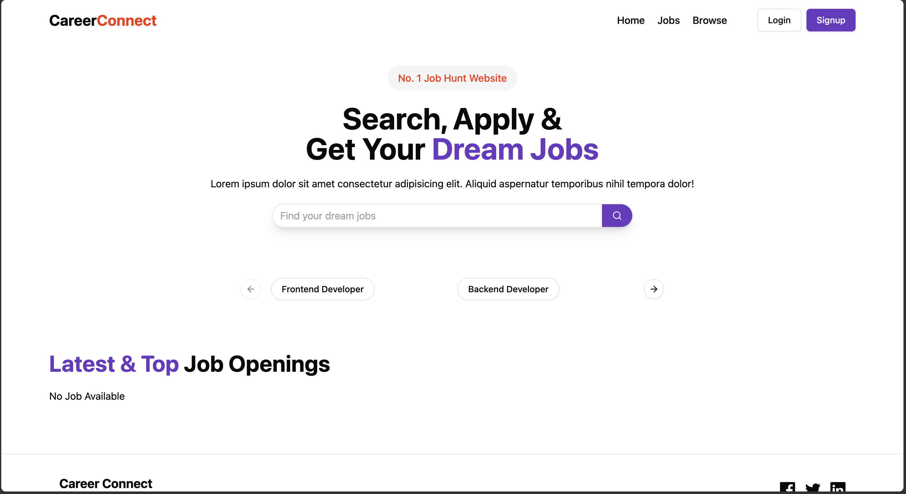
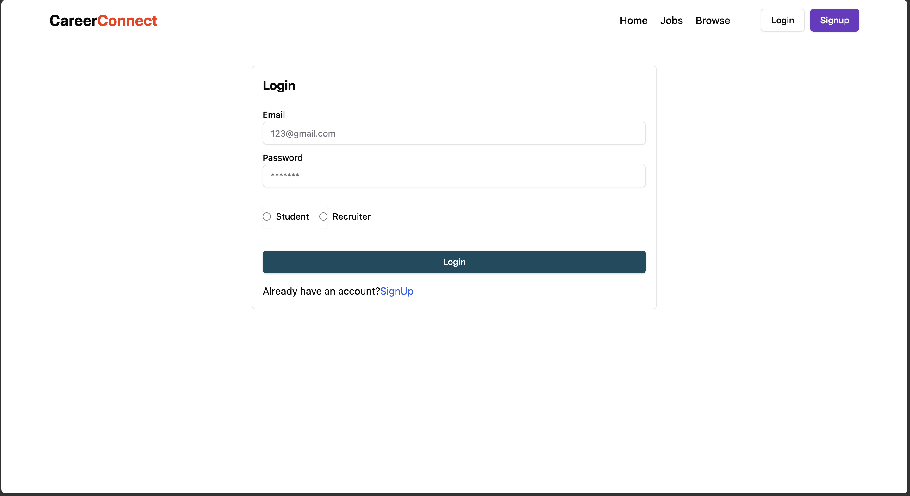
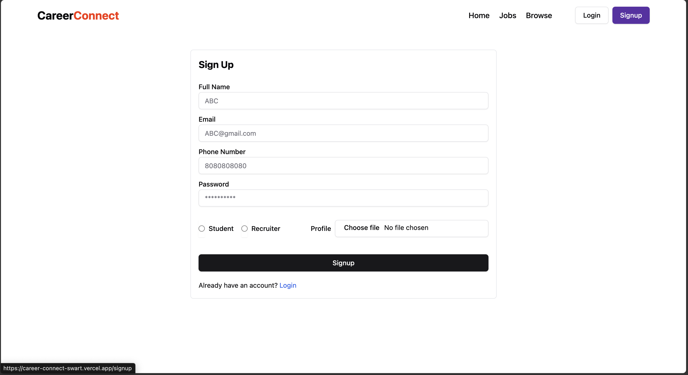

<h1>CareerConnect</h1>

https://career-connect-swart.vercel.app/

## 📌 Project Overview

**CareerConnect** is a full-stack dynamic job portal that allows **job seekers** and **employers** to interact seamlessly. It features two separate authentication systems tailored to each user type, creating a smooth and secure experience.

- Job Seekers can:
  - Sign up and create a professional profile.
  - Upload resumes and apply for jobs directly.
- Employers can:
  - Register and log in with their own portal.
  - Post new job listings and manage existing ones.
  - View and manage incoming applications.

## 🚀 Tech Stack

| Tech         | Description                     |
|--------------|---------------------------------|
| **Frontend** | React.js                        |
| **Backend**  | Node.js, Express.js             |
| **Database** | MongoDB                         |
| **Storage**  | Cloudinary (for resume uploads) |
| **Auth**     | JWT (JSON Web Tokens)           |

## 📂 Features

### 👤 Job Seeker Features
- Sign up / Login
- Create and update personal profile
- Upload resume (stored via Cloudinary)
- Browse job listings
- Apply to jobs directly

### 🧑‍💼 Employer Features
- Separate sign up / login system
- Post new job opportunities
- Edit or delete job listings
- Access and manage applications received

## 🔐 Authentication
- Role-based JWT authentication
- Secure session handling for both job seekers and employers
- Protected routes for sensitive actions (e.g., job posting, applying)

## 🖼️ Screenshots

### 🔻 Landing Page

### 🔻 Login Page

### 🔻 Signup Page

